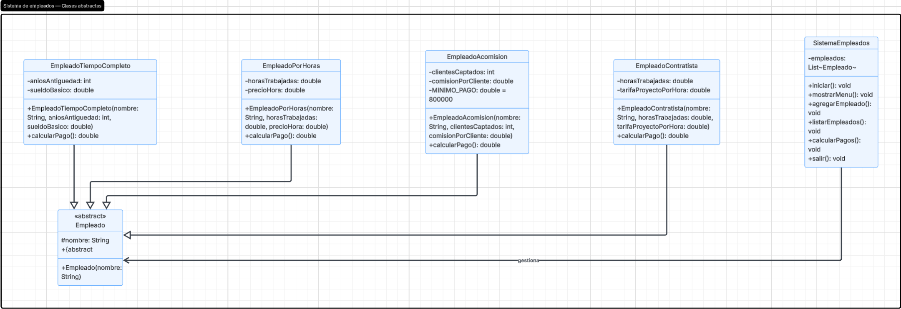

# Sistema de Gestion de Empleados

Proyecto desarrollado en Java para ejercitar los conceptos fundamentales de la **Programación Orientada a Objetos (POO)**: clases y métodos abstractos, herencia y polimorfismo.

---

## Diagrama UML

---

